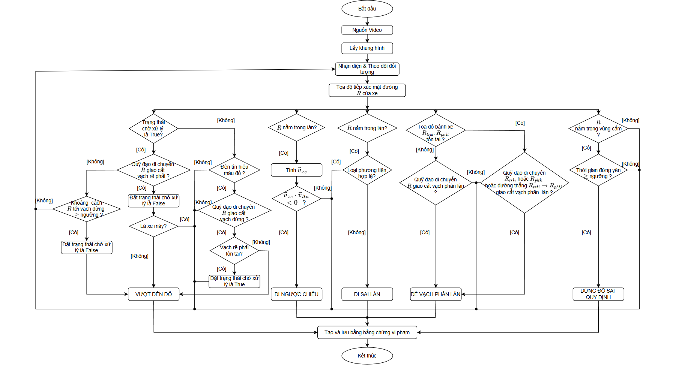

# Hệ thống Phát hiện Vi phạm Thông minh


Hệ thống AI giám sát trật tự an toàn giao thông đường bộ bằng hình ảnh — tự động phát hiện vi phạm từ camera, nhận diện biển số xe, tạo bằng chứng và sinh biên bản vi phạm PDF.

---

## 📽️ Demo
<!-- 
  Thay thế placeholder bên dưới bằng video/ảnh demo thực tế:
  - Video:  hoặc link YouTube
  - Ảnh:   
-->

> 🎬 **Demo Video:** [Ấn vào đây](https://youtu.be/woJNWR4za3E)


---

## ✨ Tính năng

- 🚗 **Phát hiện & theo dõi phương tiện** 
- 🔴 **Phát hiện vượt đèn đỏ** 
- 📏 **Phát hiện lấn vạch phân làn**
- 🚫 **Phát hiện đi ngược chiều** 
- 🛣️ **Phát hiện đi sai làn** 
- 🅿️ **Phát hiện đậu xe trái phép** 
- 🔢 **Nhận diện biển số xe**
- 🖼️ **Tạo bằng chứng tự động**
- 📄 **Sinh biên bản vi phạm PDF**
- ⚙️ **Giao diện cấu hình camera**
- 📋 **Giao diện xem hồ sơ vi phạm**
- 🌐 **Dashboard web**

---

## 🔬 Phương pháp Phát hiện Vi phạm

### Flowchart tổng quan

<!-- 
  Thay thế placeholder bên dưới bằng ảnh flowchart:
  
-->

> 📊 *Flowchart sẽ được cập nhật tại đây.*

### Mô tả ý tưởng từng loại vi phạm

#### 🚫 Đi ngược chiều

Hệ thống tính vector hướng di chuyển của xe **đối ngược** với hướng quy định của làn đường → xác nhận vi phạm.

#### 📏 Đè vạch phân làn

Sử dụng phương pháp **giao cắt hình học đoạn thẳng** giữa quỹ đạo di chuyển của xe với các vạch liền trên mặt đường. Tùy theo loại phương tiện, hệ thống áp dụng chiến lược khác nhau:

- **Xe 4 bánh** (ô tô, xe tải, xe buýt, container): Kiểm tra **3 điều kiện** — quỹ đạo bánh trái cắt vạch, quỹ đạo bánh phải cắt vạch, hoặc gầm xe đang cưỡi trên vạch.
- **Xe 2 bánh** (xe máy, xe đạp): Kiểm tra **1 điều kiện** — quỹ đạo điểm tiếp xúc mặt đường cắt vạch.

#### 🛣️ Đi sai làn

Kiểm tra xe có đang nằm trong vùng làn đường hay không, và loại phương tiện đó có **được phép lưu thông** trên làn hay không. Ví dụ: xe máy đi vào làn dành riêng cho ô tô.

#### 🔴 Vượt đèn đỏ
Nhằm phát hiện vượt đèn đỏ, hệ thống sử dụng lần lượt hai đường thẳng là `vạch dừng` và `vạch rẽ phải`. Khi một phương tiện giao thông vượt qua vạch dừng đồng thời đèn tín hiệu đang màu đỏ, trong trường hợp `vạch rẽ phải` không được cấu hình thì ghi nhận vi phạm và trường hợp còn lại thì phương tiện này được cập nhật biến trạng thái `pending`. Biến này, giúp đưa ra quyết định ghi nhận hoặc không ghi nhận vi phạm cho các trường hợp đặc biệt.

Sau khi vượt qua `vạch dừng` và `vạch rẽ phải` tồn tại, các trường hợp rẽ nhánh:
- Xe tiếp tục đi thẳng, một ngưỡng tham số được cấu hình cứng nhằm so sánh khoảng cách từ vị trí xe đến vị trí vượt qua vạch dừng. Nếu khoảng cách này > ngưỡng quy định, ghi nhận vi phạm còn ngược lại cần quan sát hướng đi tiếp theo của xe.
- Xe rẽ qua vạch rẽ phải, xét loại phương tiện của xe. Nếu là xe máy thì không ghi nhận vi phạm và ghi nhân vi phạm cho trường hợp còn lại.

#### 🅿️ Đậu xe trái phép (`IllegalParkingRule`)

Giám sát số frame phương tiện đứng yên liên tục. Nếu thời gian dừng vượt quá ngưỡng cho phép **và** xe đang nằm trong vùng cấm đỗ đang hoạt động → xác nhận vi phạm.

## 🛠️ Công nghệ sử dụng

| Thành phần | Công nghệ |
|---|---|
| Ngôn ngữ | Python 3.10+ |
| AI / Deep Learning | YOLOv26 (Ultralytics) format OpenVINO |
| Xử lý ảnh | OpenCV |
| Nhận dạng biển số | Fast plate OCR |
| Giao diện Desktop | PyQt6 |
| Web Dashboard | FastAPI + Vanilla JS (SPA) |
| Cơ sở dữ liệu | MySQL 8.0+ |

---

## 📋 Yêu cầu hệ thống

- **Python** 3.10 trở lên
- **MySQL Server** 8.0+
- **GPU** hỗ trợ CUDA *(khuyến nghị)* hoặc CPU với OpenVINO
- **Hệ điều hành:** Windows 10 / 11

---

## 🚀 Cài đặt & Khởi chạy

### 1. Clone repository

```bash
git clone https://github.com/nguyengiakhanh127/TrafficViolation-Dectection-YOLO-26.git
```

### 2. Tạo môi trường ảo

```bash
python -m venv .venv .venv\Scripts\activate
```

### 3. Cài đặt dependencies

```bash
pip install -r requirements.txt
```


### 4. Cấu hình biến môi trường

Sao chép tệp mẫu và điền thông tin:

```bash
copy .env.example .env
```

Mở `.env` và cập nhật thông tin kết nối MySQL:

```env
DB_HOST=localhost
DB_PORT=3306
DB_USER=root
DB_PASS=your_password
DB_NAME=traffic_ai_db
```

### 4. Khởi chạy ứng dụng

```bash
python main.py
```

Ứng dụng sẽ đồng thời mở:
- **Giao diện Desktop** (PyQt6)
- **Web Dashboard** tại `http://localhost:8000`

---

## 🔐 Tài khoản đăng nhập

| Vai trò | Tài khoản | Mật khẩu |
|---|---|---|
| Admin | `admin` | `admin123` |


